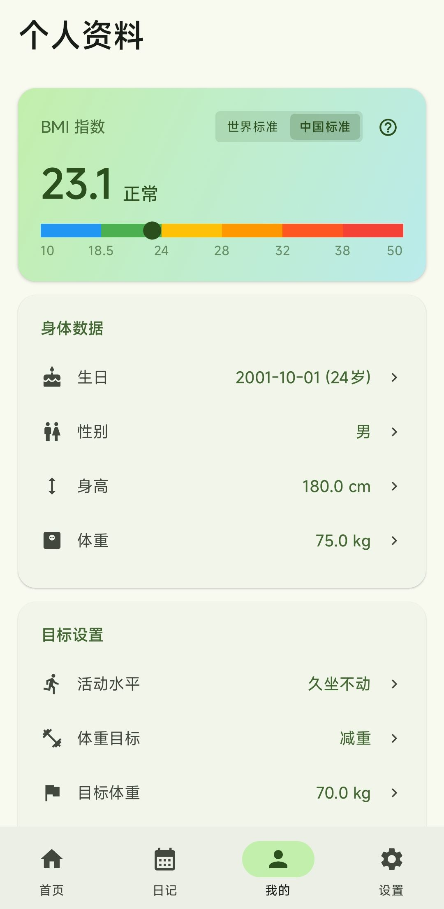
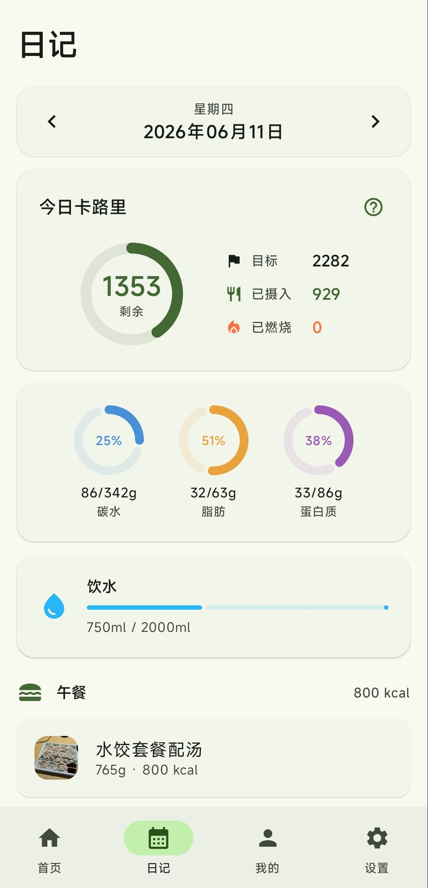
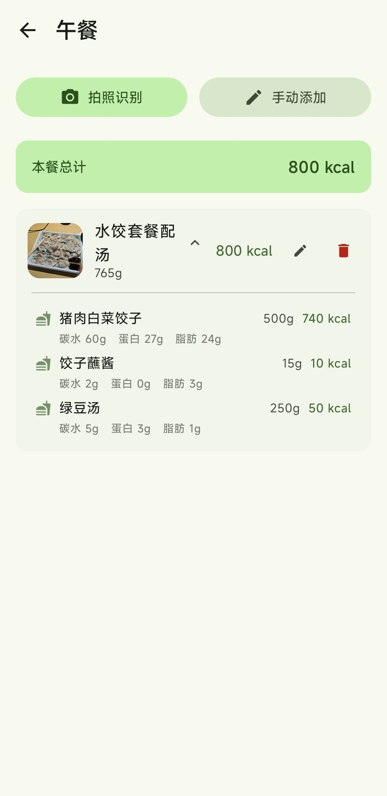
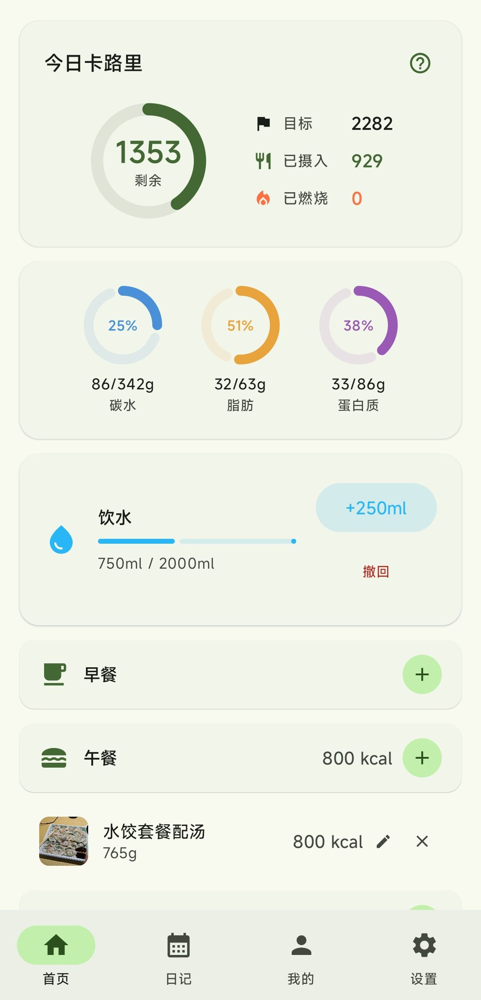
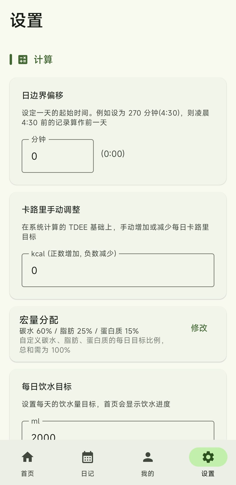

# NutriTracker

一款基于 AI 拍照识别的智能营养与卡路里追踪 Android 应用。帮助用户管理每日饮食、运动和健康目标。

## 截图

<div align="center">
&nbsp;&nbsp;
&nbsp;&nbsp;

<br><br>
&nbsp;&nbsp;

</div>

## 功能特性

**AI 食物识别**
- 拍照识别食物，自动估算重量和营养成分
- 支持中餐、复合菜品、外卖等场景
- 多图并发分析，后台异步处理

**营养追踪**
- TDEE 计算（IOM 2005 公式）
- 四餐分区记录（早餐/午餐/晚餐/零食）
- 宏量营养素（碳水/脂肪/蛋白质）目标自定义
- 体重目标渐近调整

**健康数据**
- 体育活动追踪（50+ 种运动，MET 公式计算消耗）
- 饮水记录
- 体重历史趋势
- BMI 双标准（WHO / 中国 WGOC）

## 技术栈

| 组件 | 技术 |
|------|------|
| 语言 | Kotlin 2.0.21 |
| UI | Jetpack Compose + Material Design 3 |
| 架构 | MVVM (ViewModel + StateFlow) |
| 依赖注入 | Hilt 2.53.1 |
| 数据库 | Room 2.6.1 |
| 导航 | Navigation Compose 2.8.5 |
| 相机 | CameraX 1.4.1 |
| 网络 | OkHttp 4.12.0 + Gson 2.11.0 |
| 图片加载 | Coil 2.7.0 |
| 配置存储 | DataStore Preferences 1.1.1 |

## 系统要求

- Android Studio 最新稳定版
- JDK 17+
- Android SDK 35 (compileSdk)
- 最低设备版本：Android 8.0 (API 26)

## 构建

```bash
# Debug 版本
./gradlew assembleDebug

# Release 版本（需配置签名）
./gradlew assembleRelease
```

APK 输出格式：`NutriTracker_v{版本号}_c{版本代码}_{构建类型}_{日期}.apk`

版本号在 `version.properties` 中统一管理，修改此文件即可更新版本。

## AI 配置

应用不内置 AI 服务，需在设置页自行配置：

- **API Key** - 必需
- **Base URL** - 兼容 OpenAI `/chat/completions` 接口格式
- **模型名称** - 需支持多模态图片输入

设置页提供连接测试功能，可验证 API 配置和多模态能力。

## 项目结构

```
app/src/main/java/com/example/nutritracker/
├── MainActivity.kt              # 主 Activity + 导航
├── data/                        # 数据层
│   ├── AppDatabase.kt           # Room 数据库（7 张表）
│   ├── entity/Entities.kt       # 数据实体
│   ├── dao/Daos.kt              # DAO 接口
│   └── repository/              # Repository
├── feature/                     # 功能模块
│   ├── home/                    # 首页仪表盘
│   ├── diary/                   # 日历日记
│   ├── meal/                    # 添加/编辑食物
│   ├── camera/                  # AI 拍照识别
│   ├── activity/                # 体育活动
│   ├── profile/                 # 个人资料
│   ├── settings/                # 设置
│   ├── onboarding/              # 新用户引导
│   └── sources/                 # 科学文献来源
├── navigation/                  # 路由定义
├── ui/theme/                    # MD3 主题、动画
└── util/Calculations.kt         # BMI/TDEE/MET 计算
```

## 数据库

| 表名 | 用途 |
|------|------|
| user | 用户信息（单用户模式） |
| meals | 食物营养数据 |
| intakes | 饮食摄入记录 |
| tracked_days | 每日追踪汇总 |
| activities | 体育活动记录 |
| weight_logs | 体重日志 |
| water_intakes | 饮水记录 |

## 权限

- `INTERNET` - AI API 网络请求
- `CAMERA` - 拍照识别
- `READ_MEDIA_IMAGES` - 访问相册图片

## 致谢

本项目的灵感和部分程序思路来源于 [OpenNutriTracker](https://github.com/simonoppowa/OpenNutriTracker)，在此基础上进行了重构，打造了一个轻量化的纯 Android 原生版本。

## 许可证

本项目基于 [GNU General Public License v3.0](LICENSE) 开源。
